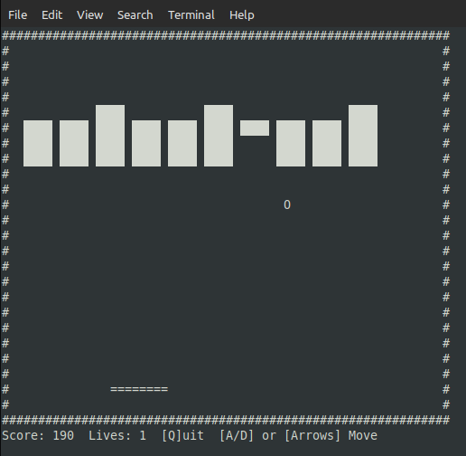

# ASCII BrickBuster Game in Ada

 
  

A classic brick-breaking game written in Ada for Linux terminals using ASCII graphics.



## Features
- Paddle controlled by keyboard
- Ball physics with collision detection
- 5 rows of bricks to break
- Score tracking
- Lives system (3 lives)

## Controls
- **A** or **a** - Move paddle left
- **D** or **d** - Move paddle right
- **Q** or **q** - Quit game

## How to Build
```bash
./build.sh
```
Or manually:
```bash
gnatmake brickbuster.adb
```

## How to Play
```bash
./play.sh (this script will restore the terminal when quitting the game)
```

## Requirements
- GNAT Ada compiler (gnatmake)
- Linux terminal

## Game Elements
- `#` - Walls and bricks
- `=` - Paddle
- `O` - Ball

## Objective
Break all the bricks by bouncing the ball with your paddle. Don't let the ball fall off the bottom!
